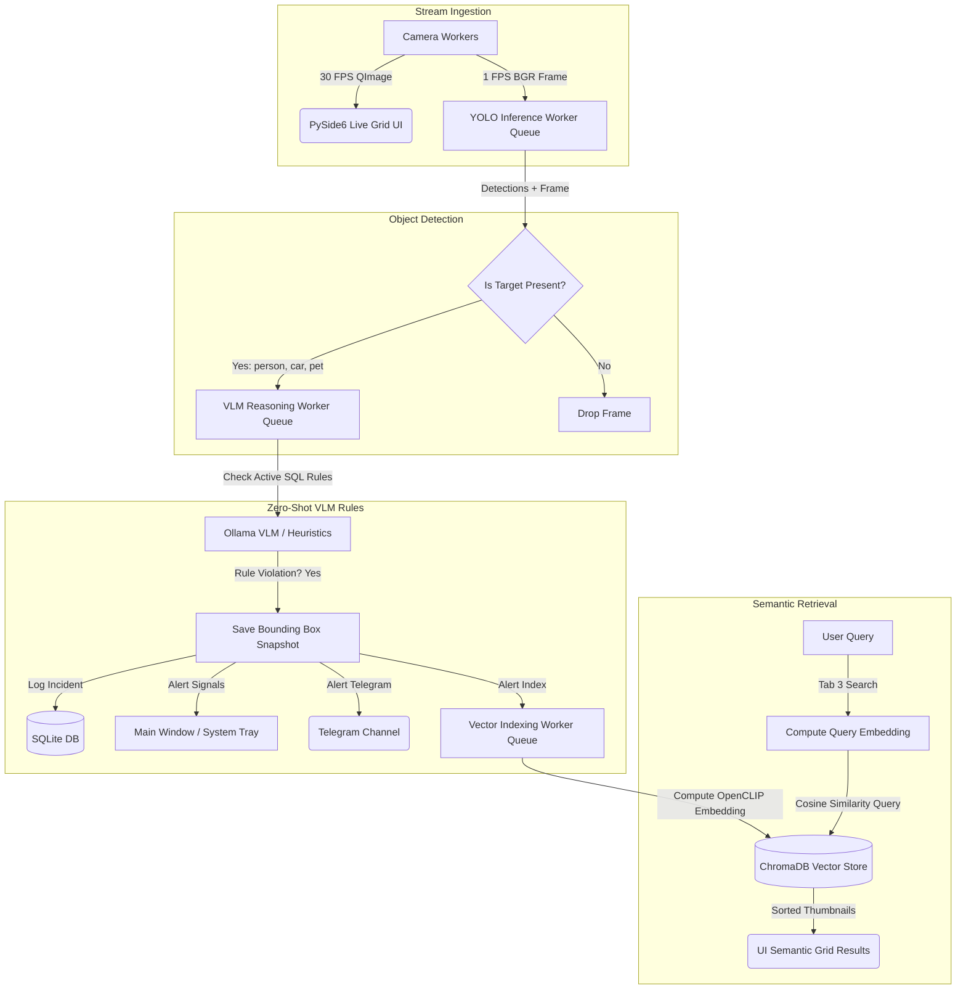

# Vision.IO Desktop
> **Privacy-First, Local Edge Surveillance Platform**

Vision.IO Desktop is a native, low-latency, privacy-centric surveillance Operations Center built using Python and PySide6. The platform is designed to operate completely on local edge hardware, offering auto-discovery of USB/ONVIF streams, multi-threaded object detection, local Vision-Language Model (VLM) rule checking, and semantic visual clip searches.

---

## 🛠️ Complete Tech Stack

*   **GUI Framework:** PySide6 (Official Qt6 bindings) styled with a custom dark NOC control-room palette
*   **Video Ingestion:** OpenCV (`cv2`) & PySide6 QtMultimedia
*   **Object Detection:** Ultralytics YOLOv10 (CPU/GPU acceleration)
*   **VLM Reasoning:** Local Ollama API (running `moondream2` or `llama3.2-vision`)
*   **Vector Database:** ChromaDB
*   **Image Embeddings:** OpenCLIP (`ViT-B/32`)
*   **Storage & Config:** SQLite (SQL-based relational schemas)
*   **Notification Engine:** Native System Tray Notifications (`QSystemTrayIcon`) & Telegram Bot API

---

## 🏗️ Multi-Threaded Architecture

To guarantee smooth, uninterrupted 30 FPS rendering on the main GUI thread, Vision.IO decouples ingestion, detection, VLM reasoning, and vector indexing into separate background workers:



---

## ✨ Key Features

1.  **Plug-and-Play Cam Ingestion:** Supports physical USB webcams via `QMediaDevices` and RTSP/NVR feeds. Features background scans via `wsdiscovery` and sockets to discover ONVIF IP cameras on the local LAN.
2.  **Resilient Camera Reconnections:** Camera ingestion loops wrap CV2 streams with exponential backoff handlers. If a feed drops, the worker automatically generates a high-fidelity vector simulator feed to keep the UI active.
3.  **Zero-Shot VLM Rule Builder:** Define camera rules in plain English (e.g. *"Alert if a delivery person drops off a package"*). The background engine continuously tests sub-sampled frames against rules without restarts.
4.  **Sandbox VLM Playground:** Sandbox testing tool allowing users to drag and drop images, write prompts, and evaluate the Ollama VLM reasoning locally before adding rules.
5.  **Semantic Video Search:** Retrieve past incidents using natural language queries (e.g., *"red delivery vehicle parked in driveway"*). Returns matching thumbnails ranked by similarity.
6.  **Dual-Mode Operational Engine:** Fallback handler when GPU/ML libraries or local services (like Ollama) are missing. Dynamically enables Jaccard text similarity engines and CV2 contour trackers to simulate operations cleanly.

---

## 📂 Project Directory Structure

```text
D:/Vision.IO/
├── main.py                    # Application launcher and seeder
├── requirements.txt           # Main dependencies register
├── vision_io.db               # SQLite config and incident database
├── mock_snapshot.jpg          # visual mock asset for initial incidents
├── db/
│   ├── __init__.py
│   └── sqlite_db.py           # Relational SQLite APIs (cameras, rules, logs)
├── utils/
│   ├── __init__.py
│   ├── discovery.py           # USB & ONVIF network auto-detect scanners
│   └── notifications.py       # Telegram channel alert client
├── workers/
│   ├── __init__.py
│   ├── camera_worker.py       # 30 FPS ingestion stream with visual simulator
│   ├── yolo_worker.py         # Asynchronous YOLO inference queue
│   ├── vlm_worker.py          # Asynchronous Ollama evaluator & logging thread
│   └── vector_worker.py       # Asynchronous CLIP indexer and ChromaDB searcher
├── ai/
│   ├── __init__.py
│   ├── yolo_engine.py         # YOLO loader with OpenCV contour/tag fallback
│   ├── vlm_engine.py          # Ollama JSON connector with heuristic fallback
│   └── clip_vector_db.py      # ChromaDB client with token-intersection fallback
└── ui/
    ├── __init__.py
    ├── style.qss              # Dark Control Room stylesheet
    ├── main_window.py         # Main container orchestrating window signals
    ├── live_monitoring.py     # Tab 1: Live grid panels and manual controls
    ├── rule_builder.py        # Tab 2: Natural language forms and drag-drop playground
    ├── semantic_search.py     # Tab 3: Semantic grid scrollbar and media player
    └── incident_log.py        # Tab 4: Double-click logs and dynamic charts
```

---

## 🚀 Installation & Setup

### Prerequisites

*   Python 3.10+
*   C++ Build Tools (Required if compiling ChromaDB from source; otherwise wheels will download)
*   [Ollama](https://ollama.com/) (For local VLM reasoning)

### 1. Set Up Environment

Navigate to the project root and create a virtual environment:
```powershell
d:
cd D:\Vision.IO
python -m venv venv
venv\Scripts\activate
```

### 2. Install Dependencies

Install PySide6, OpenCV, and other core libraries:
```powershell
python -m pip install -r requirements.txt
```

### 3. Pull VLM model
Ensure Ollama is running in the background and pull `moondream` (or `llama3.2-vision`):
```powershell
ollama pull moondream
```

### 4. Run the Application
Start the operations center:
```powershell
python main.py
```

---

## ⚙️ Configuration & Integrations

### Telegram Bot Notifications
To receive real-time messages and camera snapshots on your mobile phone:
1.  Create a Telegram bot via [@BotFather](https://t.me/botfather) and copy the **HTTP API Token**.
2.  Add your bot to a channel or query your chat ID via [@userinfobot](https://t.me/userinfobot).
3.  Set the environment variables before launching `main.py`:
    ```powershell
    $env:VISION_IO_TG_TOKEN="your_bot_token"
    $env:VISION_IO_TG_CHAT="your_chat_or_channel_id"
    ```

---

## 🎮 Operations Guide

*   **Live Feeds:** Click on a stream in the 2x2 grid to make it the active camera. Take snapshots on demand or toggle **Pause AI Engine** to view feeds without logging incidents.
*   **VLM Sandbox:** Drag a local `.jpg` image into the Sandbox area in Tab 2, write a prompt, and see how the model behaves before creating a rule.
*   **Semantic Search:** Type in descriptive sentences. Double-click on card thumbnails to play clips back or view full VLM descriptions.
*   **Double-Click Alerts:** Double-click on any alert in the log list to inspect, mark as a false positive, forward to Telegram, or open the local directory.

---

## 📄 License
This project is licensed under the MIT License. See `LICENSE` for details.
